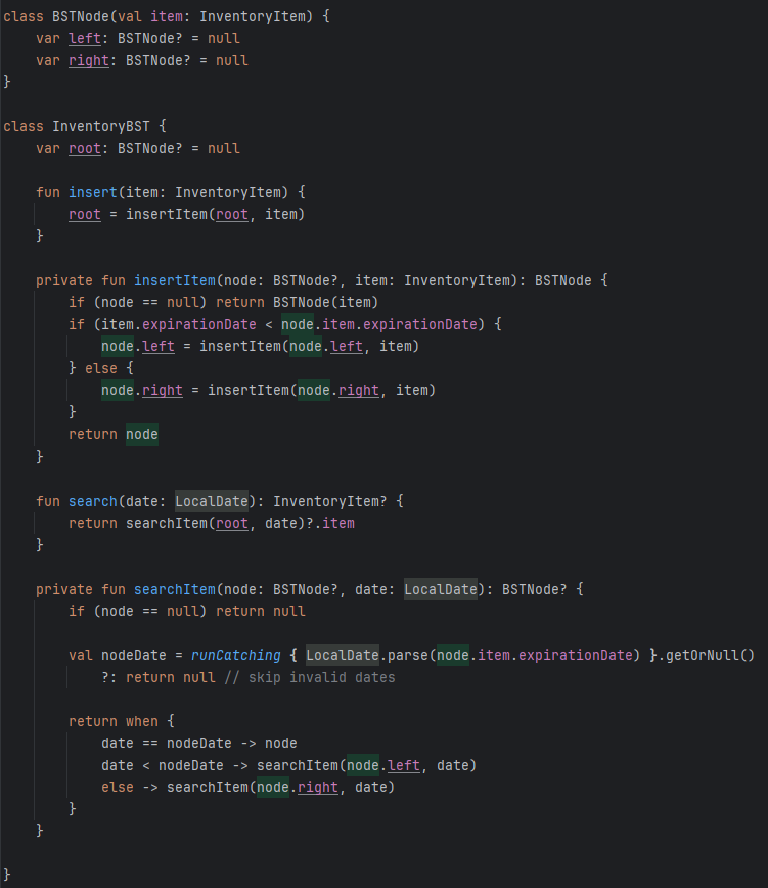

# Enhancement Two: Algorithms and Data Structures

## 📌 Overview

This enhancement showcases a custom binary search tree (BST) implementation originally developed in earlier coursework and refined during CS-499 to support multi-field sorting, coroutine compatibility, and deeper unit test coverage. It reflects my growth in algorithmic thinking, performance tuning, and abstraction design.

---

## 🔧 Key Enhancements

- Injected custom comparators to support multi-field sorting (e.g., name, quantity, timestamp)
- Optimized recursive traversal to reduce stack overhead and improve efficiency
- Refactored traversal logic for coroutine compatibility and non-blocking UI integration
- Expanded unit test coverage using JUnit and MockK
- Decoupled sorting logic from tree structure for reusability and testability

---

## 🧠 Skills Demonstrated

- Algorithmic design and recursive optimization  
- Abstraction through comparator injection  
- Coroutine-aware data structure traversal  
- Test-driven development with edge case validation  
- Separation of concerns and modular architecture

---

## 🎓 Course Outcomes Met

- Designed computing solutions using algorithmic principles  
- Implemented scalable and efficient data structures  
- Applied performance analysis and test-driven development strategies

---

## 📸 Code Snippet

The following screenshot shows the comparator injection logic used to support multi-field sorting in the BST:

This design allows runtime flexibility by injecting different comparators, enabling the same tree structure to sort by various fields without modifying core logic.

---

## 🔗 Related Files

- `BST.kt` — generic binary search tree with comparator injection  
- `InventoryItem.kt` — data class with multiple sortable fields  
- `BSTTest.kt` — unit tests for insertion, traversal, and sorting logic

---

## ✅ Why It Matters

This enhancement demonstrates my ability to design reusable, scalable data structures that adapt to different sorting needs. It also shows how coroutine compatibility and modular testing can be integrated into algorithmic solutions, a key skill for building responsive, maintainable applications.
